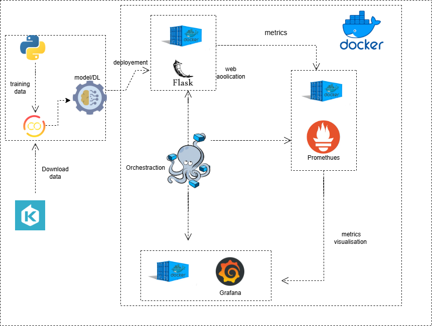
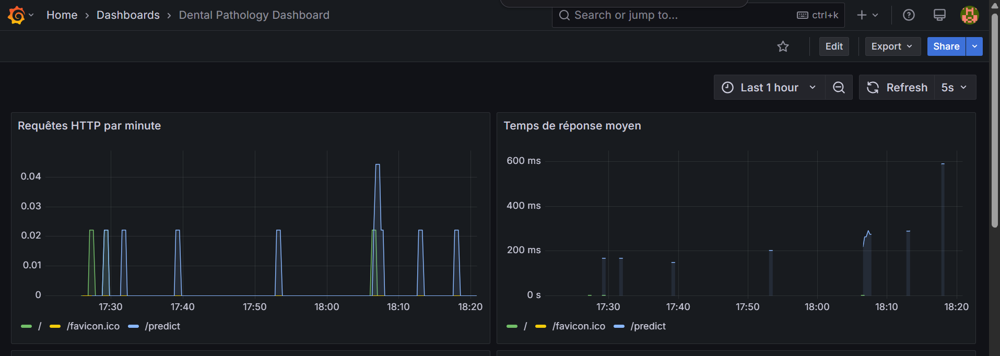
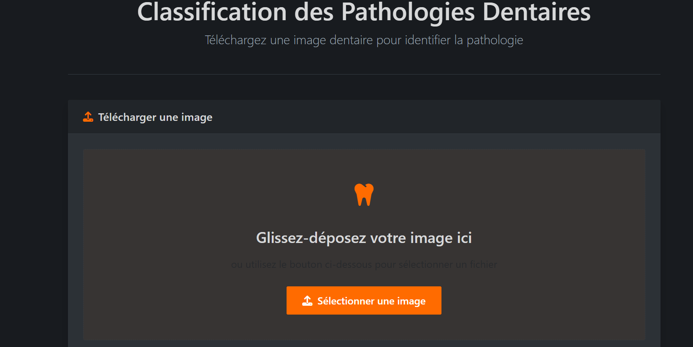
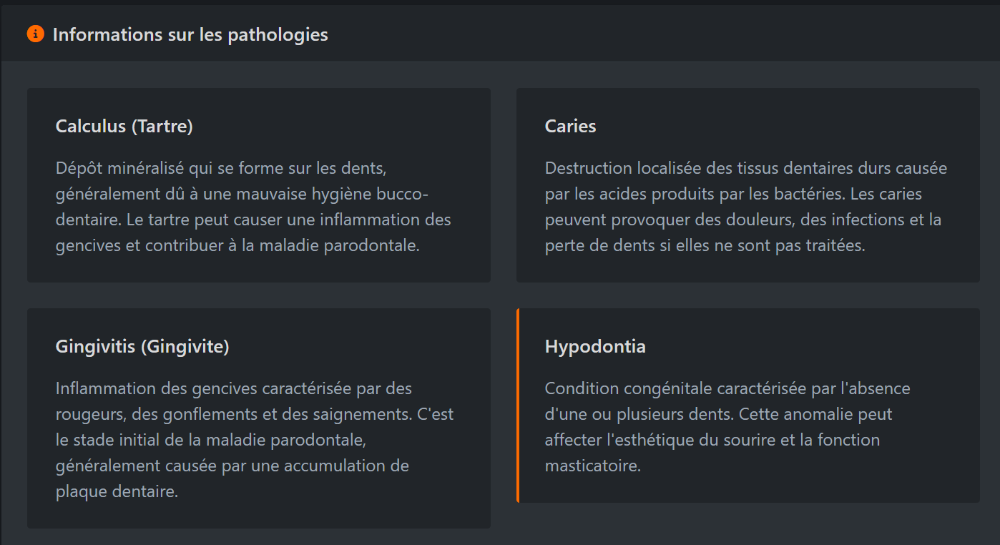

🦷 ### Classification des Pathologies Dentaires avec Supervision via Docker, Prometheus et Grafana
Ce projet propose une application web intelligente pour la classification automatique des pathologies dentaires à partir d’images, enrichie par une supervision en temps réel des métriques système et applicatives à l’aide de Prometheus et Grafana. Le tout est orchestré via Docker Compose, garantissant une installation et une gestion faciles et reproductibles.

🔧 Technologies Utilisées:

| Technologie        | Rôle                                                        |
|--------------------|-------------------------------------------------------------|
| 🐍 Python / Flask  | Backend de l'application web                                 |
| 🔥 PyTorch         | Modèle de deep learning pour la classification dentaire     |
| 📈 Prometheus      | Collecte et exposition des métriques système et applicatives |
| 📊 Grafana         | Visualisation dynamique des métriques                       |
| 🐳 Docker Compose  | Orchestration des conteneurs                                 |
| 🎨 HTML / CSS      | Interface utilisateur simple et fonctionnelle                |

#⚙️ Prérequis:

Avant de commencer, assurez-vous d'avoir installé :

Docker

Docker Compose

#📁 Structure du Projet:

├── app.py                 # Application Flask principale
├── app_modified.py        # Version instrumentée avec Prometheus
├── Dockerfile             # Image Docker de l’application
├── docker-compose.yml     # Orchestration multi-conteneurs
├── models/                # Modèle entraîné (PyTorch)
├── prometheus/            # Configuration Prometheus
├── grafana/               # Provisioning automatique de Grafana
├── requirements.txt       # Dépendances Python
├── save_model.py          # Chargement et préparation du modèle
├── templates/             # Fichiers HTML de l'interface utilisateur
├── images/                # Schémas et captures d’écran du projet
└── dataset_organisé/      # Données structurées pour l’entraînement

#🚀 Installation & Exécution:

1. Cloner le dépôt:
git clone <url-du-repo>
cd Pathologies-Dentaires
2. Construire et lancer les services:
docker-compose up --build
3. Arrêter les services:
docker-compose down

#🌐 Accès aux Services:

| Service        | URL                        | Description                              |
|----------------|----------------------------|------------------------------------------|
| 🖥️ Application | [http://localhost:5000](http://localhost:5000) | Interface de classification d'images     |
| 📡 Prometheus  | [http://localhost:9090](http://localhost:9090) | Visualisation des métriques brutes       |
| 📊 Grafana     | [http://localhost:3000](http://localhost:3000) | Dashboards (Identifiants : admin/admin) |

#🏗️ Architecture du Projet:

L’architecture du projet repose sur une infrastructure Dockerisée et modulaire :

Flask App : Service de traitement des images et retour des prédictions.

Prometheus : Collecte des métriques exposées via un endpoint /metrics.

Grafana : Tableaux de bord pour visualiser les performances du modèle et l’état du système.

#📊 Supervision des Métriques:

L'application expose des métriques via Prometheus, visualisables dans Grafana :

🔧 Métriques Système :

Utilisation CPU

Consommation mémoire

Activité réseau

#🧠 Métriques Applicatives :

Nombre de prédictions par classe

Temps moyen de traitement par image

Nombre et codes des requêtes HTTP

#🧑‍💻 Interface Utilisateur:

L’utilisateur peut téléverser une image dentaire et obtenir une prédiction immédiate de la pathologie :

#🦷 Informations sur les Pathologies:

Chaque classe du modèle correspond à une pathologie dentaire, avec affichage des détails médicaux :

#⚙️ Personnalisation & Extensions:

| Fonctionnalité                         | Action                                                                 |
|----------------------------------------|------------------------------------------------------------------------|
| 🔁 Ajouter de nouvelles pathologies     | Ajouter des images dans `dataset_organisé/` et réentraîner le modèle  |
| 📐 Modifier les dashboards Grafana     | Éditer les fichiers dans `grafana/provisioning/dashboards/`           |
| 📥 Ajouter des métriques personnalisées | Étendre `app_modified.py` avec des décorateurs Prometheus              |

#👨‍🔧 Auteur:

Projet réalisé par Aghzar Otmane dans le cadre d’un projet universitaire.
Ce projet allie Deep Learning, Monitoring DevOps et conteneurisation, dans une logique d’intégration continue.

#📄 Licence:

Ce projet est sous licence MIT.
Voir le fichier LICENSE pour plus d'informations.

